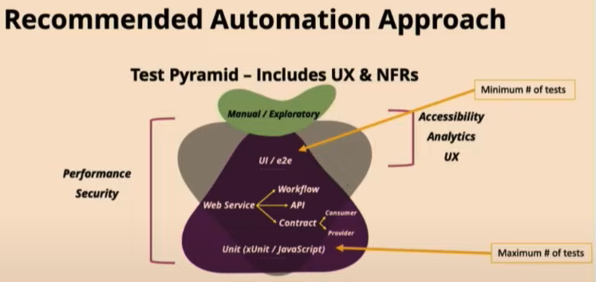
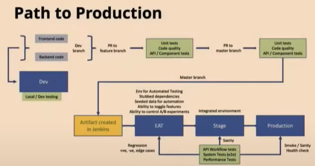

# Metrics-Quality-Practice
The fundanmentals of metrics to our software quality assurance practice.

## What is quality?

## How do you know what is the quality of your product?
- Gut feeling?
- Trust?
- or Some Concret Data?

## But, who are you?
- Let's get to know each other

## How do you know if your efforts are adding value?

## What metrics do you use to measure and understand quality?

## What does quality mean to me?
- Who am I?
  - What metrics are relevant to me?
  - How do these metrics help me make the product better?

## Metrics that indicate quality!
### Leader Perspective
- Speed of delivery
  - Cycle Time
  - Change Lead Time (CLT)
  - Working In Progress (WIP)
  - Bug Leakage with Root Cause Analysis (RCA)
  - Tech Debt - development, testing and testing automation
- Quality of the product
  - Test execution status
    - Execution time
    - RCA of failures
    - Per environment
  - Mean time to recover (MTTR)
  - Defect RCA
    - by priority/severity
    - by environment
    - by automation/non-automation coverage
### Test Team Perspective
- Automated Tests
  - Test Pyramid
  - Functional & Visual
  - Non-Function Requirements (NFRs), Code Coverage & Quality Gates
    - NFRs: performance, reliability, security, usability, scalability, and maintainability
  - Test Execution Time
    - per suite
    - per environment
  - RCA of failures
    - Environment issues
    - Product issues
    - Test data issues
    - Test automation issues
    - Flaky tests
      - Timing issues
      - Environment Variability
      - Data Dependency
      - Test Order Dependency
  - Trend Analysis
  - Build Pass Rate
  - Number of new tests automated
- Non-Automated Tests
  - Reduction of time for manual regression testing
  - Escaped defects from automation
  - Number of testing completed/remaining
  - Number of tests re-executed
  - Number of new tests added
- Defects
  - Defect leakage in path to production
    - Category
    - Priority & Severity
    - RCA
  - Age of WIP defects

### Product Team Perspective
- Are signed-off requirements continuing to pass?
- Comparing feedback of released features VS expectations
- Number of "feedback" provided for user stories

### Other Roles Perspective
#### Developer Perspective
- Code Quality
- Number of active/inactive branches
- Number of successful builds
- Number of builds with pipeline-as-code
- Number of tests in each repository
- Number of successful releases
- Number of releases from master/main branch
- Feedback time to developers after pushing change
- Number of regression test failures

#### Design Team Perspective
#### Ops Team Perspective
#### Senior Reliable Engineer (SRE) Perspective
#### Data Engineer Perspective

## Some practices that will help
- Automatioin
  - Test Pyramid

  - Test Executioin Strategy
    - Define Path to Production

    - Build for scale, increased coverage and quick feedback
      - Test Data Strategy
      - Parallel Execution
- Unified and Real-Time Dashboard
  - Personas
  - 80/20 Rule
  - Automated data collection
  - Visualise results to enable taking decisions

## What next?
- Know your personas
- Identify core metrics that indicate quality
- Metrics should help take quick decisions
  - All good
  - Investigate further
- Take decisions to make the product better
- Take decisions to improve processes and practices